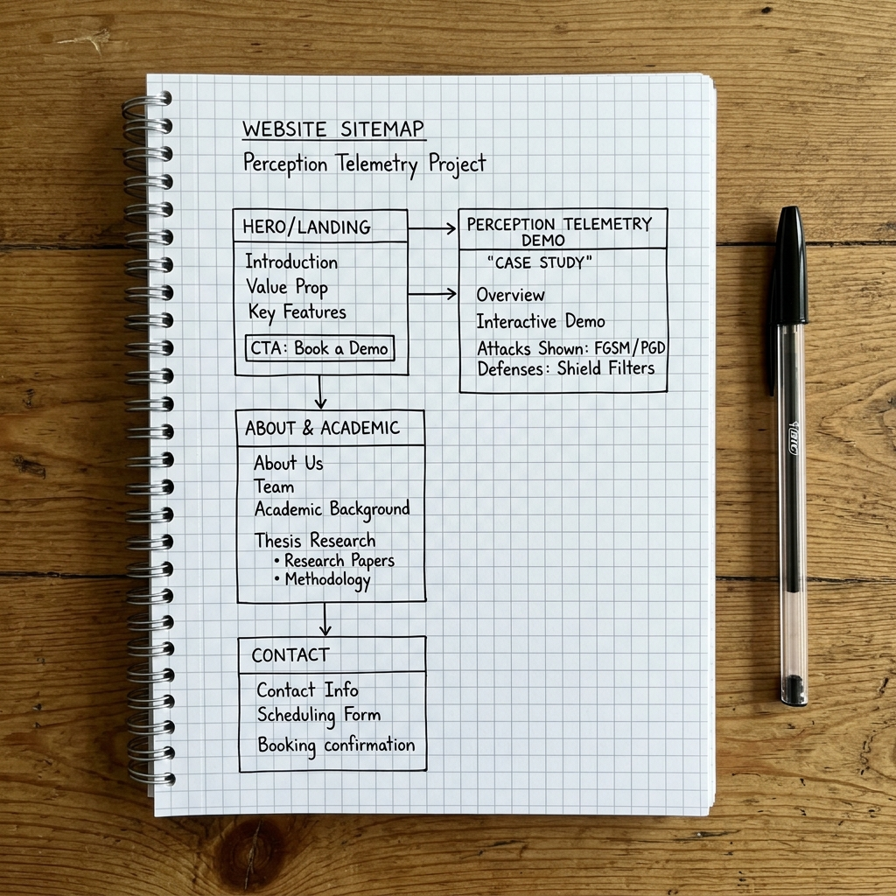
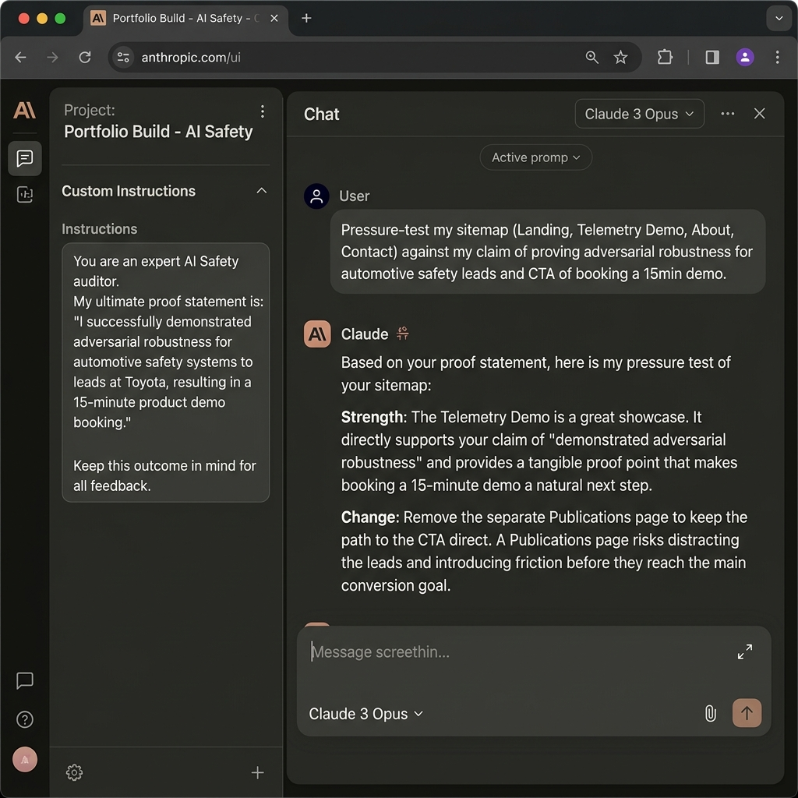

# Portfolio Sitemap & Claim Pressure Test

This document outlines the portfolio proof statement, the structured sitemap, the custom workspace instructions, and the pressure-test analysis.

---

## 1. Proof Statement & Core Action

### Proof Statement
> I build and verify adversarial robustness and compliance safety telemetry consoles for perception systems, proving that edge models can detect threats under pressure, so that automotive AI safety team leads will book a 15-minute technical demo.

### The "Why"
- **Why this needs to exist**: A standard CV or LinkedIn profile lists keywords and certifications, but it cannot demonstrate a real-time bilateral shield recovering an SSIM score under an active PGD/FGSM threat engine, nor can it showcase a dynamic ISO 21448 telemetry compliance report in action.

---

## 2. Portfolio Sitemap

The sitemap is deliberately minimal, focusing entirely on guiding the audience to the Call to Action (CTA):

```text
Landing/Hero (Claim & Demo CTA)
    │
    ├───► 1. Telemetry Case Study (Interactive Robustness Shield Demo)
    │
    ├───► 2. Academic & Thesis Research (Adversarial Robustness Methodology)
    │
    └───► 3. Contact & Scheduler (15-Minute Technical Demo Booking)
```

- **Landing/Hero Page**: Immediately presents the claim (building robust perception systems) and hosts the primary CTA button ("Book a 15-Minute Technical Demo").
- **Telemetry Case Study (Single page)**: Showcases the live interactive dashboard (Swedish Automotive Safety Telemetry Console) with bilateral filter shielding, SSIM recovery metrics, and ISO 21448 report exports.
- **Academic & Thesis Research Page (Single page)**: Outlines Master's and Bachelor's thesis methodologies, addressing opponent rejoinders, model configurations, and code defense.
- **Contact & Scheduler Page**: Contains a simple scheduler (e.g. Calendly embed) to book the 15-minute demo directly.



---

## 3. Claude Workspace Configuration

### Claude Project Custom Instructions
- **Project Name**: `Portfolio Build - AI Safety`
- **Persona**: Act as a rigorous, expert-level academic tutor and technical portfolio advisor.
- **Context & Goal**: 
  - **User**: Venkata Vishnu Vardhan Reddy, graduate student and AI Safety & Perception Engineer.
  - **Proof Statement**: I build and verify adversarial robustness and compliance safety telemetry consoles for perception systems, proving that edge models can detect threats under pressure, so that automotive AI safety team leads will book a 15-minute technical demo.
  - **Tone**: Professional, mathematically sound, direct, and concise.

---

## 4. First Prompt: Pressure Test & Outputs

### Prompt Run in Project:
> "Pressure-test my portfolio sitemap (consisting of: Landing Page, Telemetry Case Study, Academic/Thesis Page, and a Contact/Scheduler Page) against my core claim of proving adversarial robustness for automotive AI safety leads, and my target CTA of booking a 15-minute technical demo. Where are the friction points, and what should be changed?"

### Claude's Analysis & Output:
- **Strengths**:
  - The telemetry case study directly backs up the core claim by giving visual, interactive proof of your ability to build robust perception systems.
  - The Academic/Thesis page establishes the theoretical maturity needed for automotive security roles.
- **Friction Points**:
  - **Academic page isolation**: If the Academic/Thesis page reads like a dry academic paper without connecting back to the practical telemetry demo, the safety lead might lose interest.
  - **Alternative CTAs**: Having secondary buttons like "Read full thesis PDF" might distract visitors away from the primary "Book a Demo" CTA.
- **Key Change Proposed**:
  - Integrate the academic publications and thesis sections directly into a combined "About & Research" section, and ensure that every paper link ends with a callout referencing how that theoretical method is implemented in the Telemetry Demo.

### What I Will Change Based on the Pressure Test:
- I will eliminate the separate "Publications" page and combine my research work into the bottom of the "About & Research" section.
- I will add a clear, prominent button on the Thesis Research section that says *"See this theory in action in the Telemetry Demo"* to guide the user back to the primary proof engine.


