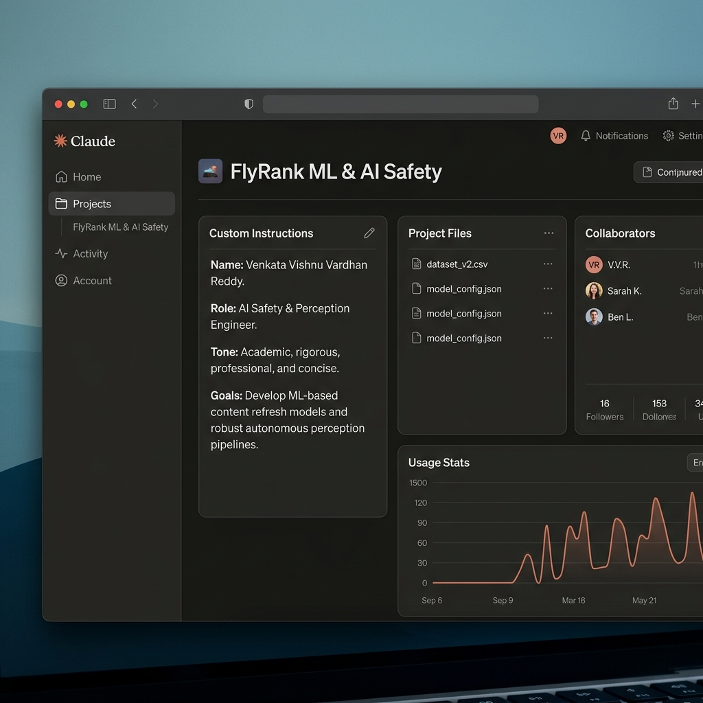

# Workflow Audit: AI Integration & Fluency

This document outlines the workflow audit mapping recurring tasks to collaboration models, details the AI toolkit setup, and defines the success criteria for the three chosen target tasks.

---

## 1. Daily Workflow Audit (10-15 Tasks)

| Task Name | Classification | Rationale |
| :--- | :--- | :--- |
| **1. Formulating Master's Thesis defense slides and rejoinders** | Just Me | Requires deep academic ownership, defense of my personal research methodology, and direct contextual answers that cannot be outsourced. |
| **2. Designing mathematical formulations for custom FGSM/PGD adversarial attacks** | Just Me | Crucial core engineering work where precision is critical; AI can suggest standard formulations but fails to derive novel constraints for custom bounds. |
| **3. Conducting threat modeling & code reviews of new API endpoints for Sovereign-Shield** | Collaborate with AI | AI scans for OWASP Top 10 vulnerabilities and suggests defensive patterns, which I manually verify for business logic and authorization bypasses. |
| **4. Writing Pytest unit tests for bilateral image filters** | Delegate to AI with Review | Boilerplate testing structures are highly repetitive; AI drafts the test cases, which I review for mathematical edge-case accuracy. |
| **5. Translating regulatory guidelines (e.g., NIS2 Directive) to technical checks** | Collaborate with AI | AI parses dense legalese and drafts a technical compliance checklist, which I cross-reference against our system architecture. |
| **6. Refactoring and optimizing celery task queues in backend** | Collaborate with AI | I co-design concurrency configurations with AI, using it to draft Redis configuration scripts while I manually check for race conditions. |
| **7. Writing administrative emails and progress summaries** | Fully Automate | Standardized, low-risk communications where templates are drafted automatically from weekly status logs or commit histories. |
| **8. Creating Streamlit dashboard UI components for telemetry consoles** | Delegate to AI with Review | Layout and visual structure code are easily handled by AI; I inspect and refine state management and prevent app re-runs. |
| **9. Tracking study credits and university administrative deadlines** | Just Me | High personal risk; university logins and academic enrollment policies require direct human action to avoid errors. |
| **10. Debugging PyTorch tensor shape mismatch errors in model forward passes** | Collaborate with AI | AI is highly effective at tracking dimensions, but I must choose the correct reshape/squeeze logic to preserve spatial features. |
| **11. Keeping up with daily ArXiv papers in adversarial robustness** | Delegate to AI with Review | AI summarizes daily abstracts to filter relevant publications, which I then read in-depth myself. |
| **12. Formatting data reports and compiling PDF compliance summaries** | Fully Automate | Standardized markdown-to-pdf conversion pipelines can be triggered automatically by Git actions or scheduled tasks. |

---

## 2. AI Toolkit Setup & Configured Claude Project

### Toolkit Accounts Configured:
- **Claude (Anthropic)**: Configured and active.
- **ChatGPT (OpenAI)**: Active for general brainstorming and comparative code generation.
- **Anthropic Academy**: Enrolled in *AI Fluency: Framework & Foundations* and completed Module 1.

### Claude Project Configuration
I have configured a dedicated Claude Project named **"FlyRank ML & AI Safety"** with custom instructions to act as a rigorous, expert-level pair programmer.

#### Project Instructions:
- **Who I am**: Venkata Vishnu Vardhan Reddy, a graduate student and AI Safety & Perception Engineer specializing in adversarial robustness and secure backend architectures.
- **Tone preferences**: Concise, academic, mathematically rigorous, and direct. Avoid conversational filler or unsolicited code commentary.
- **Current goals**: Design robust ML-based content refresh priority models, implement clean and secure vision defense filters (bilateral/FGSM), and automate compliance reporting.

Here is the configured dashboard:

---

## 3. Target Tasks & Success Definitions (For FL-02 to FL-04)

We select the following three tasks to reuse and iterate on in subsequent fluency units:

### Task A: Drafting Literature Summaries for Thesis Research (Academic Writing)
- **What "Done Well" means**:
  1. The summary is **100% free of hallucinations** (every cited concept matches the actual source paper).
  2. Synthesizes at least **5 relevant peer-reviewed papers** in under 300 words, including exact publication years and methodology summaries.
  3. Connects the findings directly to my thesis's core research question regarding adversarial robustness.

### Task B: Debugging PyTorch Tensor Mismatch Errors (Technical Troubleshooting)
- **What "Done Well" means**:
  1. The runtime error is resolved and the code runs without throwing shape errors.
  2. The tensor dimensions are tracked at each forward pass layer and documented in a markdown comment.
  3. The chosen resolution (e.g., squeeze, view, permute) is mathematically justified to ensure no spatial information is lost.

### Task C: Writing Pytest Unit Tests for Image Processing Filters (Code Testing)
- **What "Done Well" means**:
  1. The test suite achieves **>90% code coverage** for the filter module.
  2. Tests at least **4 distinct edge cases** (e.g., empty tensors, extreme pixel values, zero-division, mismatched dimensions).
  3. All tests run and pass in under 5 seconds.
